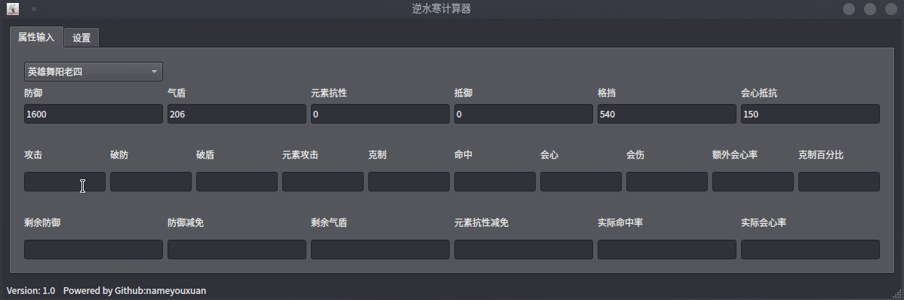

# NshCala 

逆水寒计算器

# 演示

# Todo
- [x] 数值计算
- [x] 检测更新
- [ ] 使用代理 

# 开发

## 关键词中英文对照
| 属性名称                           | 英文名称                             |
|----------------------------------|------------------------------------|
| 防御                             | Defense                            |
| 气盾                             | Aegis                              |
| 元素抗性                         | Elemental Resistance               |
| 抵御                             | Resilience                         |
| 格挡                             | Block                              |
| 会心抵抗                         | Critical Resistance                |
| 攻击                             | Attack                             |
| 破防                             | Armor Penetration                  |
| 破盾                             | Shield Break                       |
| 元素攻击                         | Elemental Attack                    |
| 克制                             | Advantage                          |
| 命中                             | Accuracy                           |
| 会心                             | Critical Hit                       |
| 会伤                             | Critical Damage                    |
| 额外会心率                        | Bonus Critical Rate                |
| 克制百分比                        | Restraint Percentage               |
| 剩余防御                         | Remaining Defense                  |
| 防御减免                         | Defense Reduction                  |
| 剩余气盾                         | Remaining Aegis                    |
| 元素抗性减免                     | Elemental Resistance Reduction     |
| 实际命中率                       | Actual Accuracy Rate               |
| 实际会心率                       | Actual Critical Rate               |
| 未会心伤害                       | Non-Critical Damage                |
| 包含命中会心的伤害期望           | Expected Damage with Accurate Critical |
